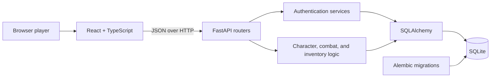

# TinyRPG

TinyRPG is a full-stack browser RPG built with **FastAPI, SQLAlchemy, React, and TypeScript**. Players create characters, fight monsters using tactical combat options, earn experience, level up, manage inventory, and maintain a secure account.

The project began as a Python learning exercise and grew into a tested web application with authentication, database migrations, API design, and a responsive frontend.

## Highlights

- Character creation with Warrior, Mage, and Rogue classes
- Tactical combat with Balanced, Aggressive, and Defensive stances
- Optional Power Strike attacks with increased damage and miss risk
- Monster difficulty estimates, random encounters, and narrated combat logs
- Persistent experience points, level requirements, health, and inventory
- Rest, revive, rename, and level-up character actions
- JWT bearer authentication with rotating refresh sessions
- Email verification and password-reset flows
- Session management, security-event history, rate limiting, and account disabling
- Cursor pagination and authenticated resource ownership
- Alembic migrations for repeatable database changes
- Automated Python and React tests with linting and static type checks

## Technology

| Area | Tools |
| --- | --- |
| Backend | Python 3.12, FastAPI, Pydantic |
| Database | SQLAlchemy 2, Alembic, SQLite |
| Authentication | JWT access tokens, rotating refresh cookies, Argon2 password hashing |
| Frontend | React 19, TypeScript, Vite |
| Testing | pytest, Vitest, React Testing Library |
| Quality | Ruff, mypy, ESLint, TypeScript |

## Architecture



FastAPI routers separate authentication, users, characters, combat, inventory, and administration. Pydantic schemas validate requests and shape responses. SQLAlchemy models store accounts, sessions, characters, inventory, XP, tokens, and security events.

## Gameplay

Each character has a class, health, level, and persistent XP. Monsters have their own health, damage, and XP rewards.

Before a fight, the player chooses a stance:

- **Balanced** uses the character's normal damage.
- **Aggressive** increases both outgoing and incoming damage.
- **Defensive** reduces both outgoing and incoming damage.
- **Power Strike** adds 5 damage but causes rolls from 1 through 5 to miss.

Victories award XP. Leveling from level 1 costs 100 XP, level 2 costs 200 XP, and each following level costs `current level × 100`. Characters can reach level 10.

## Project structure

```text
Tiny RPG/
├── frontend/                 React and TypeScript application
├── migrations/               Alembic database revisions
├── docs/                     Authentication, HTTP, email, and configuration guides
├── tests/                    Backend tests
├── tinyrpg/
│   ├── routers/              FastAPI endpoint groups
│   ├── schemas/              Pydantic request and response models
│   ├── services/             Authentication and rate-limiting services
│   ├── database_models.py    SQLAlchemy models
│   └── gameplay.py           Monster definitions and progression rules
├── main.py                   Original command-line game
└── pyproject.toml            Python package and tool configuration
```

## Run locally

### Requirements

- Python 3.12 or newer
- Node.js 20.19 or newer
- npm

### Backend

From the project directory:

```powershell
python -m venv .venv
.\.venv\Scripts\Activate.ps1
python -m pip install -r requirements.txt
Copy-Item .env.example .env
python -m alembic upgrade head
python -m uvicorn tinyrpg.api:app --reload
```

The API runs at [http://127.0.0.1:8000](http://127.0.0.1:8000), with interactive OpenAPI documentation at [http://127.0.0.1:8000/docs](http://127.0.0.1:8000/docs).

### Frontend

In a second terminal:

```powershell
cd frontend
npm install
Copy-Item .env.example .env
npm run dev
```

Open [http://localhost:5173](http://localhost:5173).

## API overview

| Area | Examples |
| --- | --- |
| Authentication | Register, sign in, refresh, log out, verify email, reset password |
| Account | Update profile, change password, inspect or revoke sessions, view security events |
| Characters | Create, list, rename, delete, rest, revive, level up |
| Combat | List monsters and fight with stance and Power Strike options |
| Inventory | List, add, replace, use, and remove character items |
| Administration | List users through a role-protected endpoint |

Character, combat, and inventory routes require an `Authorization: Bearer <token>` header. Resources are scoped to the authenticated owner.

## Security work

TinyRPG includes several practical authentication and account-security features:

- Argon2 password hashing
- Short-lived JWT access tokens
- Hashed and revocable refresh tokens
- Refresh-token rotation and reuse detection
- Per-device session management
- Single-use email verification and password-reset tokens
- Consistent recovery responses that avoid revealing whether an email exists
- Authentication rate limiting
- Append-only security events
- Production checks for secrets, HTTPS origins, secure cookies, and SMTP

The checked-in configuration contains development defaults only. Production secrets belong in the deployment platform's secret manager.

## Tests and quality checks

Run backend checks from the project directory:

```powershell
python -m pytest
python -m ruff check tinyrpg tests migrations
python -m mypy tinyrpg
```

Run frontend checks from `frontend`:

```powershell
npm test
npm run lint
npm run build
```

The repository currently contains more than 100 backend tests and more than 30 frontend tests covering authentication, ownership, character actions, combat, XP progression, inventory, configuration, and user interaction.

## Documentation

- [Authentication and bearer tokens](docs/authentication.md)
- [HTTP fundamentals](docs/http-fundamentals.md)
- [Database migrations](docs/database-migrations.md)
- [Configuration](docs/configuration.md)
- [CSRF protection](docs/csrf-protection.md)
- [Email delivery](docs/email-delivery.md)

Important environment variables include `DATABASE_URL`, `FRONTEND_ORIGINS`, `JWT_SECRET_KEY`, `FRONTEND_URL`, and the optional SMTP settings documented in `.env.example`.

## Project status

TinyRPG is a working portfolio project under active development. The main gameplay loop, authentication system, persistence layer, migrations, and automated checks are implemented. Future work could include turn-by-turn encounters, equipment, character abilities, deployment, and original game artwork.
